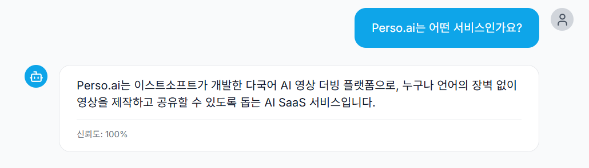

<div align="center">

# 🤖 Perso.ai 지식기반 챗봇

<p align="center">
  <strong>Vector DB 기반 RAG 시스템을 활용한 지능형 Q&A 챗봇</strong>
</p>

[](https://opensource.org/licenses/MIT)
[](https://www.python.org/)
[](https://fastapi.tiangolo.com/)
[](https://nextjs.org/)
[](https://www.typescriptlang.org/)
[](https://qdrant.tech/)
[](https://www.docker.com/)
[](https://ai.google.dev/)



<br/>

<a href="https://perso-chat-bot.vercel.app">
  
</a>

<br/>

</div>

## 프로젝트 개요

제공된 Q&A 데이터셋을 벡터 데이터베이스에 저장하고, 사용자 질문에 대해 관련 정보를 검색하여 Hallucination 없이 정확한 답변을 제공하는 RAG(Retrieval-Augmented Generation) 기반 챗봇입니다.

## 사용 기술 스택

### Backend
- **Language**: Python 3.11
- **Framework**: FastAPI
- **Vector DB**: Qdrant
- **Embedding Model**: Google Gemini Embedding API (`gemini-embedding-001`, 768-dim)
- **LLM**: Google Gemini 2.0 Flash
- **Libraries**: `qdrant-client`, `google-genai`, `pandas`, `numpy`

### Frontend
- **Language**: TypeScript
- **Framework**: Next.js 14 (App Router)
- **Styling**: Tailwind CSS
- **Libraries**: `axios`, `react-markdown`, `lucide-react`

### Infrastructure
- **Containerization**: Docker & Docker Compose
- **Vector DB Storage**: Qdrant (Docker)

### 기술 선택 이유

**Gemini API (Embedding & LLM)**
빠른 응답 속도와 높은 성능을 고려하여 사용했습니다.
초기에는 HuggingFace 로컬 모델을 사용했지만, 무료 배포 환경(Railway/Render)에서 모델 로딩과 임베딩 계산 시간이 과도하게 길어져 API 방식으로 전환했습니다.

**Qdrant (Vector Database)**
RAG 시스템에서 빠르고 정확한 유사도 검색이 중요하다고 생각해 고성능 벡터 검색을 제공하는 Qdrant를 선택했습니다.
(Python 클라이언트와의 연동성과 Docker 환경에서 배포의 용이성을 고려한 선택이기도 합니다.)

**FastAPI (Backend Framework)**
비동기 처리를 기본 지원하여 LLM 및 벡터 DB와의 통신 지연을 효율적으로 관리할 수 있어 선택했습니다.

**Next.js 14 & Tailwind CSS (Frontend)**
ChatGPT 스타일의 대화형 UI를 빠르게 구현하기 위해 선택했습니다.
추가적으로, React 기반으로 채팅 메시지 컴포넌트 재사용이 쉽고,
TypeScript로 API 응답 타입을 명확히 정의할 수 있어 런타임 에러를 줄일 수 있다는 점도 고려했습니다.

## 시스템 아키텍처

```
[User Query]
    ↓
[Query Rewriter] ← Gemini API
    ↓
[Embedding Service] ← Gemini Embedding API (768-dim vector)
    ↓
[Vector DB Search] ← Qdrant (Cosine Similarity) (retrieve)
    ↓
[Context Formatting] (Top-K 결과 → Context) (Augmented)
    ↓
[LLM Generation] ← Gemini 2.0 Flash (Generation)
    ↓
[Response]
```

## 벡터 DB 및 임베딩 방식, 검색 과정 설명

### 임베딩 모델

**Google Gemini Embedding API** (`gemini-embedding-001`)를 사용하여 텍스트를 768차원 벡터로 변환하도록 했습니다.

**구성:**
- 모델: `gemini-embedding-001`
- 차원: 768
- Task Type: `RETRIEVAL_DOCUMENT`

### 벡터 데이터베이스

**Qdrant 구성:**
- Collection: `perso_ai_qa`
- Vector dimension: 768
- Distance metric: Cosine Similarity
- Payload 구조:
  ```python
  {
    "chunk_id": "고유 ID",
    "question": "원본 질문",
    "answer": "원본 답변",
    "content": "질문: {question}\n답변: {answer}",
    "metadata": {"source", "row_number", "category"}
  }
  ```

### 데이터 전처리 및 인덱싱

1. Excel 파일에서 Q&A 쌍을 추출하고 구조화
2. 각 Q&A를 "질문: {question}\n답변: {answer}" 형태로 결합
3. Gemini Embedding API로 각 청크를 768차원 벡터로 변환
4. Qdrant에 벡터와 메타데이터를 저장

### 검색 과정

1. 사용자 쿼리를 Query Rewriter로 최적화
2. 최적화된 쿼리를 768차원 벡터로 임베딩
3. Qdrant에서 코사인 유사도 기반 Top-K 검색 (기본 K=3)
4. 유사도 임계값(기본 0.5) 이상인 결과만 필터링
5. 검색된 컨텍스트를 LLM 프롬프트에 포함하여 답변 생성

## 정확도 향상을 위해,

### 1. Query Rewriting

- Gemini API로 질문을 동의어와 관련 용어로 확장
- 검색 친화적인 형태로 변환하되 원본 의도는 유지함
- 검색 범위를 넓혀 관련 문서를 더 잘 찾을 수 있음

**예시**
```
원본: "Perso.ai 가격은?"
재작성: "Perso.ai 요금제 가격 정책 비용"
```

### 2. Similarity Threshold

일정 유사도 이상의 결과만 사용하여 부정확한 정보 제공 방지

**설정**
- Default threshold: 0.5
- Top-K: 3개의 가장 유사한 결과 검색
- Threshold 이하의 결과는 무시하여 노이즈 제거

### 3. Augmented Generation

검색된 컨텍스트를 구조화된 형태로 LLM에 제공하고, 프롬프트 엔지니어링을 통해 Hallucination 방지

**포맷**
```
[참고 자료 1]
질문: ...
답변: ...
(유사도: 0.85)

[참고 자료 2]
질문: ...
답변: ...
(유사도: 0.72)
```

**System Prompt**
```
You are an AI assistant that answers questions about Perso.ai.

Important rules:
1. Use only the provided reference materials to answer.
2. Do not guess or make up information not in the reference materials.
3. If you cannot provide an accurate answer, say "The information is not available in the provided materials."
4. Provide friendly and clear answers.
5. Use the exact expressions from the reference materials when possible.
```

### 4. Confidence Score 계산

검색 결과 품질 기반 신뢰도 점수 계산 후 사용자에게 제공

**계산 방식:**
```python
confidence = avg_similarity_score + relevance_boost
# relevance_boost: 유사도 0.7 이상 결과 개수당 0.1씩 추가 (max 0.3)
```

이를 통해 사용자가 답변의 신뢰성을 판단할 수 있도록 했습니다.

### 5. 하이퍼파라미터 튜닝

- `top_k=3`
- `score_threshold=0.5`
- `temperature=0.1`

## 프로젝트 구조

```
├── backend/
│   ├── app/
│   │   ├── core/                    # 핵심 레이어 (인터페이스, 설정)
│   │   ├── infrastructure/          # 인프라 레이어 (Gemini, Qdrant 구현체)
│   │   ├── domain/                  # 도메인 레이어 (비즈니스 로직)
│   │   ├── application/             # 응용 레이어 (의존성 주입)
│   │   ├── presentation/            # 표현 레이어 (API 라우터)
│   │   ├── services/                # 유틸리티 서비스
│   │   └── main.py
│   └── scripts/
│       └── preprocess_data.py       # 인덱싱 스크립트
├── frontend/
│   └── src/
│       ├── components/
│       │   └── ChatInterface.tsx    # 채팅 UI
│       └── lib/
│           └── api.ts               # API 클라이언트
└── docker-compose.yml
```

## 실행 방법

### 환경 설정

1. Gemini API Key 발급: https://aistudio.google.com/apikey
2. `backend/.env` 파일 생성 및 API Key 설정

### Docker 기반 실행

```bash
# 서비스 시작
docker-compose up -d

# 데이터 인덱싱
docker-compose exec backend python scripts/preprocess_data.py

# 접속: http://localhost:3000
```

### 로컬 개발 환경

```bash
# Qdrant 시작
docker run -d -p 6333:6333 qdrant/qdrant

# Backend
cd backend
python -m venv venv
source venv/bin/activate
pip install -r requirements.txt
cp .env.example .env  # GEMINI_API_KEY 설정
python scripts/preprocess_data.py
uvicorn app.main:app --reload

# Frontend
cd frontend
npm install
npm run dev
```

## 배포 정보

- **Backend**: Railway/Render
- **Frontend**: Vercel
- **Vector DB**: Qdrant (Docker container on Railway/Render)